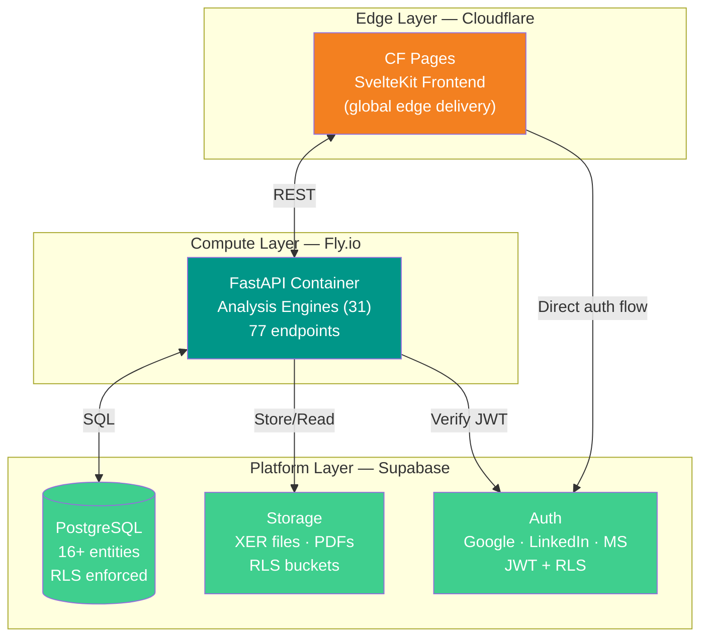
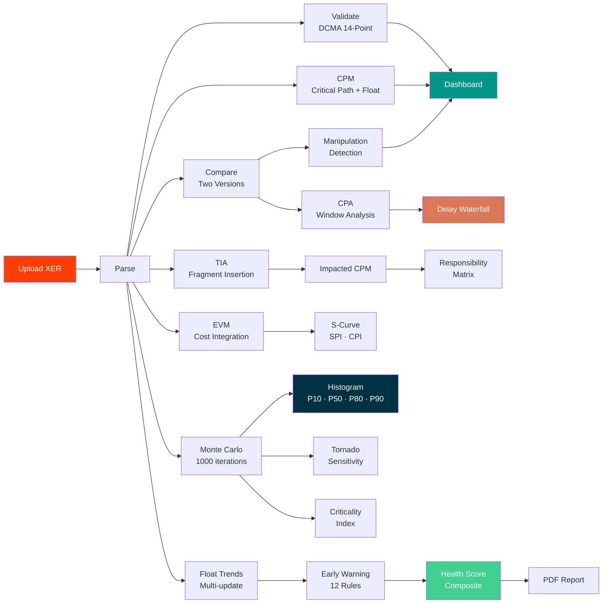

<div align="center">

# MeridianIQ

**The intelligence standard for project schedules**

Open-source schedule intelligence platform — from validation to prediction to generation.

[](LICENSE)
[](https://python.org)
[](https://fastapi.tiangolo.com)
[](https://kit.svelte.dev)
[](https://vite.dev)
[]()
[](https://supabase.com)
[](https://meridianiq.vitormr.dev)

[**Documentation**](docs/) · [**Contributing**](CONTRIBUTING.md) · [**Changelog**](BUGS.md)

</div>

---

## Overview

**MeridianIQ** is an open-source platform for project schedule analysis in construction and engineering. It provides the tools that schedulers, project controls professionals, and forensic delay analysts need — transparent, auditable, and free.

Every methodology is traceable to published standards: AACE Recommended Practices, DCMA 14-Point Assessment, SCL Delay and Disruption Protocol, and GAO Schedule Assessment Guide.

> **Author:** Vitor Maia Rodovalho

---

## Key Numbers

| Indicator | Value |
|-----------|-------|
| Analysis engines | 32 + 1 export module (CPM · DCMA · Compare · CPA · TIA · EVM · Monte Carlo · Forensics · Half-Step · Delay Prediction ML · Benchmarks · What-If · Scorecard · Resource Leveling · Schedule Generation · Evolution Optimizer · 4D Visualization · Calendar Validation · Delay Attribution + more) |
| MCP tools | 21 (Claude integration via FastMCP) |
| Schedule formats | 2 (Primavera P6 XER + Microsoft Project XML) |
| Tests passing | 748+ backend + 70 E2E |
| Frontend pages | 39 |
| API endpoints | 77 |
| SVG chart components | 10 (hand-crafted, no chart.js) |
| Released versions | 20 (v0.1.0 → v3.1.0) |
| Live platform | [meridianiq.vitormr.dev](https://meridianiq.vitormr.dev) |
| Monthly infra cost | $0 (free tier) |

---

## Capabilities

| Capability | Standard | Version |
|-----------|----------|---------|
| **XER Parsing** — Custom MIT-licensed Primavera P6 parser | — | v0.1 |
| **Schedule Validation** — DCMA 14-Point Assessment with scoring | DCMA EVMS | v0.1 |
| **Critical Path Analysis** — Forward/backward pass, total float | CPM (Kelly & Walker, 1959) | v0.1 |
| **Schedule Comparison** — Multi-layer matching, manipulation detection | — | v0.1 |
| **Forensic Analysis** — Contemporaneous Period Analysis | AACE RP 29R-03 | v0.2 |
| **Time Impact Analysis** — Delay fragments, impacted vs unimpacted CPM | AACE RP 52R-06 | v0.3 |
| **Contract Compliance** — Automated provision checks | AIA A201, SCL Protocol | v0.3 |
| **Earned Value Management** — SPI, CPI, EAC, S-Curve | ANSI/EIA-748 | v0.4 |
| **Monte Carlo Simulation** — QSRA with PERT-Beta distributions | AACE RP 57R-09 | v0.5 |
| **Float Trend Analysis** — Track float distribution across schedule updates | AACE RP 49R-06 | v0.8 |
| **Early Warning System** — 12-rule alert engine for proactive monitoring | DCMA EVMS | v0.8 |
| **Schedule Health Score** — Composite metric combining all indicators | — | v0.8 |
| **PDF Reports** — WeasyPrint-generated reports for all analysis modules | — | v0.8 |
| **Half-Step Bifurcation** — Separates progress vs revision delay effects | AACE RP 29R-03 MIP 3.4 | v2.1 |
| **ML Delay Prediction** — Activity-level risk scoring with SHAP-like factors | Gondia et al. (2021) | v2.1 |
| **Benchmark Database** — Anonymized cross-project percentile comparison | — | v2.1 |
| **What-If Simulator** — Deterministic + probabilistic scenario analysis | AACE RP 57R-09 | v2.2 |
| **Schedule Scorecard** — 5-dimension weighted letter grades A-F | DCMA + GAO | v2.2 |
| **Duration Prediction** — RF+GB ensemble trained on benchmark data | AbdElMottaleb (2025) | v2.2 |
| **Resource Leveling** — RCPSP via Serial SGS with 4 priority rules | Kolisch (1996) | v2.3 |
| **Schedule Generation** — Template-based with stochastic durations | — | v2.3 |
| **Conversational Builder** — NLP-driven schedule creation via Claude API | — | v2.3 |
| **XER Export** — Round-trip fidelity write-back to P6 format | Oracle P6 XER | v3.0 |
| **Evolution Strategies Optimizer** — (mu, lambda) ES for RCPSP | Loncar (2023) | v3.0 |
| **Anomaly Detection** — IQR/z-score outlier detection for schedule data | — | v2.0 |
| **Root Cause Analysis** — Backwards network trace via NetworkX | AACE RP 49R-06 | v2.0 |

---

## Architecture



---

## Analysis Pipeline



---

## Roadmap

| Version | Codename | Focus | Status |
|---------|----------|-------|--------|
| v0.1.0 | **Foundation** | Parse · Validate · Compare · Visualize | ✅ Released |
| v0.2.0 | **Forensics** | CPA / Window Analysis | ✅ Released |
| v0.3.0 | **Claims** | TIA + Contract Compliance | ✅ Released |
| v0.4.0 | **Controls** | EVM / WBS-CBS-BOQ | ✅ Released |
| v0.5.0 | **Risk** | Monte Carlo / QSRA | ✅ Released |
| v0.6 | **Cloud** | Supabase + Fly.io + CF Pages | ✅ Released |
| v0.7 | **Identity** | Auth + RLS + Ownership | ✅ Released |
| v0.8 | **Intelligence** | Float Trends + Early Warning + Health Score | ✅ Released |
| v0.9 | **Polish** | UX + CI/CD + E2E + i18n + Demo | ✅ Released |
| v1.0 | **Enterprise** | Teams + IPS + Recovery + Multi-format + Audit | ✅ Released |
| v2.0 | **AI** | ML Predictions · NLP · Anomaly Detection · MCP | ✅ Released |
| v2.1 | **Prediction** | Half-Step MIP 3.4 · Delay ML · Benchmarks · GDPR | ✅ Released |
| v2.2 | **Scenarios** | What-If Simulator · Scorecard · Duration ML · Pareto | ✅ Released |
| v2.3 | **Optimization** | Resource Leveling RCPSP · Schedule Generation · Builder | ✅ Released |
| v3.0 | **Full Lifecycle** | XER Export · ES Optimizer · Benchmark Priors · 4D Viz | ✅ Released |

See [full roadmap with architecture decisions](docs/v06-planning/ROADMAP_v06_to_v20.md).

---

## Quick Start

### Prerequisites

- Python 3.12+ (CI tests on 3.14)
- Node.js 20+
- A [Supabase](https://supabase.com) project (free tier) with URL and anon/service keys

### Local Development

```bash
# Clone
git clone https://github.com/VitorMRodovalho/meridianiq.git
cd meridianiq

# Configure environment
cp .env.example .env
# Edit .env: set SUPABASE_URL, SUPABASE_ANON_KEY, SUPABASE_SERVICE_ROLE_KEY

# Backend
pip install -e ".[dev]"
python -m uvicorn src.api.app:app --reload --port 8000

# Frontend
cd web
npm install
npm run dev -- --port 5173

# Open http://localhost:5173
```

**Or with Docker:**
```bash
docker compose up
```

### Live Platform

The platform is deployed and available at **[meridianiq.vitormr.dev](https://meridianiq.vitormr.dev)**.

---

## Technical Stack

| Layer | Technology |
|-------|-----------|
| **Backend** | Python 3.12+ · FastAPI · Pydantic v2 |
| **CPM Engine** | NetworkX (BSD) |
| **Monte Carlo** | NumPy (BSD) |
| **PDF Generation** | WeasyPrint |
| **Frontend** | SvelteKit · Tailwind CSS v4 |
| **Charts** | SVG (hand-crafted, zero dependencies) |
| **Database** | Supabase PostgreSQL (managed, RLS enforced) |
| **File Storage** | Supabase Storage (RLS buckets) |
| **Authentication** | Supabase Auth (Google · LinkedIn · Microsoft OAuth) |
| **Backend Hosting** | Fly.io (Docker, auto-deploy) |
| **Frontend Hosting** | Cloudflare Pages (global edge) |
| **Testing** | pytest (440+ passing) · Playwright E2E (25 passing) |

---

## Standards & References

MeridianIQ implements methodologies from these published standards:

| Standard | Application |
|----------|------------|
| AACE RP 29R-03 | Forensic Schedule Analysis |
| AACE RP 49R-06 | Documenting the Schedule Basis |
| AACE RP 52R-06 | Time Impact Analysis |
| AACE RP 57R-09 | Integrated Cost and Schedule Risk Analysis |
| AACE RP 10S-90 | Cost Engineering Terminology |
| ANSI/EIA-748 | Earned Value Management Systems |
| DCMA EVMS | 14-Point Schedule Assessment |
| GAO Schedule Guide | Schedule Assessment Methodology |
| SCL Protocol | Delay and Disruption Protocol (2nd Ed.) |
| CPM | Kelly & Walker (1959) |

---

## Repository Structure

```
meridianiq/
├── src/
│   ├── parser/           # Custom MIT XER parser
│   │   ├── xer_reader.py # Streaming parser, encoding detection
│   │   ├── models.py     # 17+ Pydantic models
│   │   └── validator.py  # Constraint validation
│   ├── analytics/
│   │   ├── cpm.py        # NetworkX CPM engine
│   │   ├── dcma14.py     # DCMA 14-Point Assessment
│   │   ├── comparison.py # Multi-layer matching
│   │   ├── forensics.py  # CPA per AACE RP 29R-03
│   │   ├── tia.py        # TIA per AACE RP 52R-06
│   │   ├── contract.py   # Contract compliance
│   │   ├── evm.py        # EVM per ANSI/EIA-748
│   │   ├── risk.py       # Monte Carlo per AACE RP 57R-09
│   │   ├── float_trends.py     # Float trend tracking
│   │   ├── early_warning.py    # 12-rule early warning engine
│   │   ├── health_score.py     # Composite schedule health metric
│   │   └── report_generator.py # WeasyPrint PDF reports
│   ├── database/         # Supabase client, config, store abstraction
│   └── api/
│       ├── app.py        # FastAPI (45 endpoints)
│       └── schemas.py    # Request/response models
├── web/                  # SvelteKit + Tailwind
├── tests/                # 440+ backend tests
├── supabase/
│   └── migrations/       # PostgreSQL schema migrations (6 files)
├── .github/
│   └── workflows/ci.yml  # CI/CD: test + lint + E2E + deploy
├── docs/                 # Discovery & definition documents
├── v1-reader/            # Legacy P6 reader (upstream attribution)
├── v1-compare/           # Original XER compare tool
├── v1-program-schedule/  # Production schedule analytics
├── CLAUDE.md             # Claude Code project instructions
├── docker-compose.yml
├── pyproject.toml
├── LICENSE (MIT)
├── CONTRIBUTING.md
├── ATTRIBUTION.md
└── ACKNOWLEDGMENTS.md
```

---

## Contributing

We welcome contributions! See [CONTRIBUTING.md](CONTRIBUTING.md) for guidelines.

**Areas where help is needed:**
- Additional schedule formats (Microsoft Project XML, Asta Powerproject)
- Methodology validation against real-world experience
- International contract compliance (FIDIC, NEC, JCT)
- Performance optimization for 50,000+ activity schedules
- Additional chart types and visualizations

---

## Academic Use

MeridianIQ is designed to support academic research in project controls and forensic schedule analysis. If you use MeridianIQ in your research, please cite:

```bibtex
@software{meridianiq,
  author = {Rodovalho, Vitor Maia},
  title = {MeridianIQ: Open-Source Schedule Intelligence Platform},
  year = {2025},
  url = {https://github.com/VitorMRodovalho/meridianiq},
  note = {Implements AACE RP 29R-03, 52R-06, 57R-09; DCMA 14-Point; ANSI/EIA-748}
}
```

---

## License

Code is licensed under [MIT](LICENSE).

See [ATTRIBUTION.md](ATTRIBUTION.md) for upstream credits and [ACKNOWLEDGMENTS.md](ACKNOWLEDGMENTS.md) for tooling acknowledgments.

---

<div align="center">

**MeridianIQ** · MIT License · © 2025 Vitor Maia Rodovalho

*Built with academic rigor. Every methodology traceable to published standards.*

</div>
