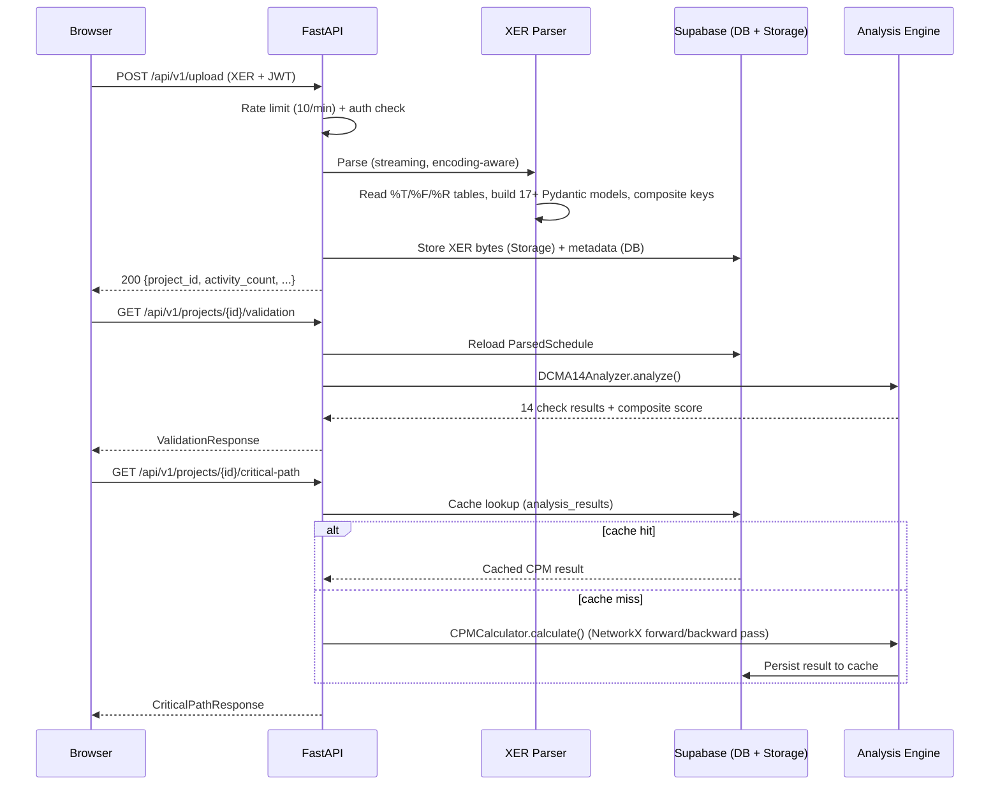
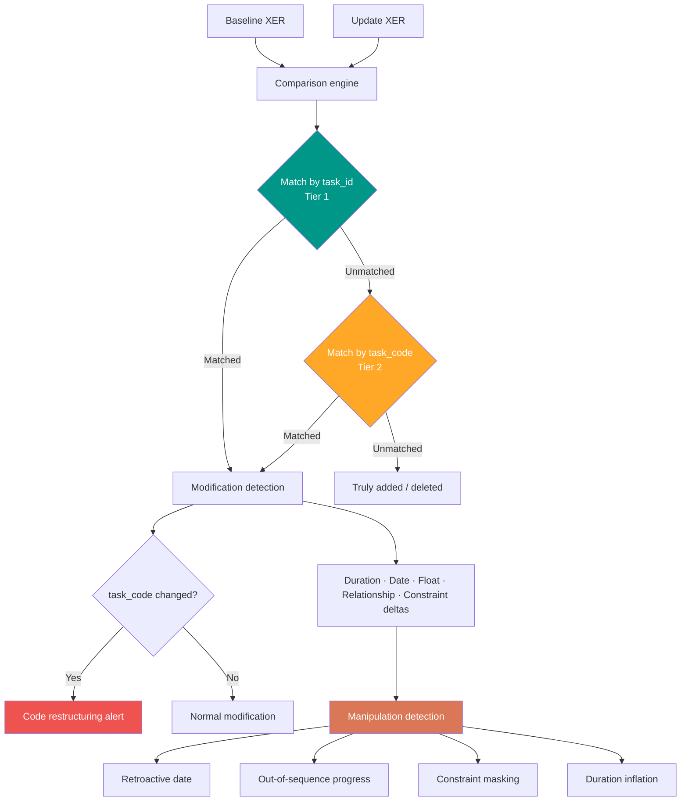
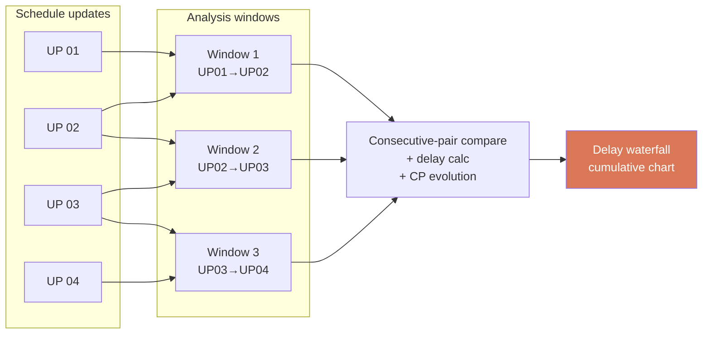
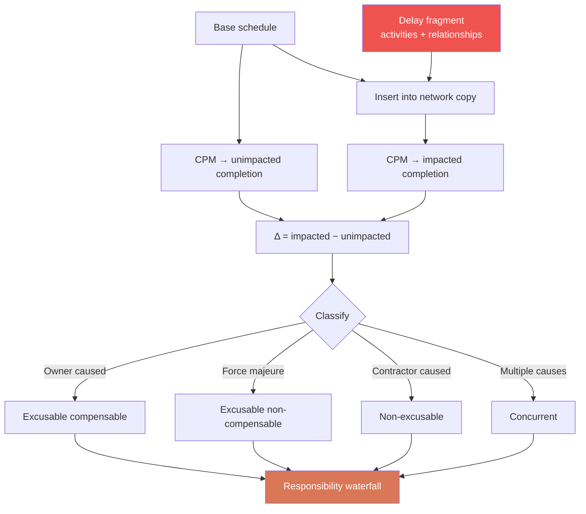
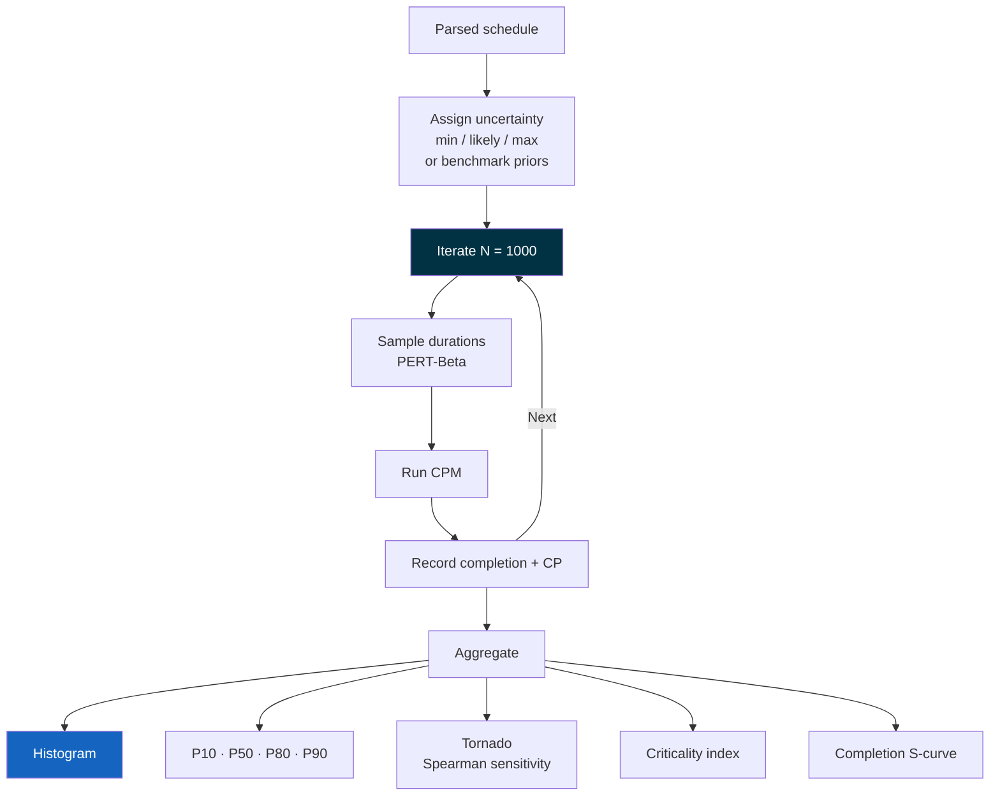
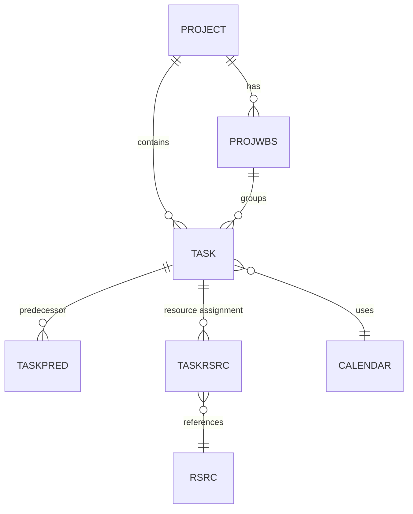
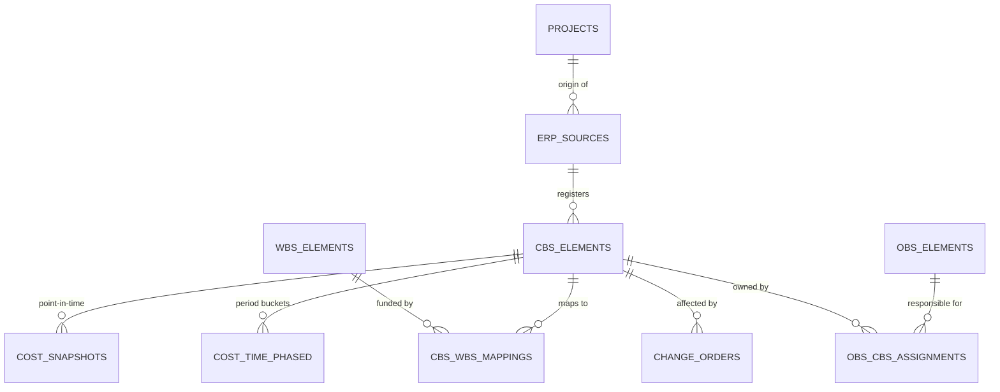

<!-- Last updated: 2026-04-27 (post-Cycle-3 W4 code-side close) -->
# MeridianIQ — System Architecture

## System Overview

MeridianIQ is a **modular monolith**: a single FastAPI application with clearly separated analysis engines, each implementing a specific published methodology and written to stay independent of every other engine. The frontend is a SvelteKit SPA served from Cloudflare Pages and talks to the backend via REST.

As of **v4.2.0** (β-honest path-A discipline — Cycle 3 close-arc + Cycle 4 close): 48 analysis engines + 1 export module, 127 API endpoints across 25 routers, 55 SvelteKit pages, 11 hand-crafted SVG chart components, 28 Supabase migrations, 22 MCP tools, 15 PDF report types, 1652 tests.

```mermaid
graph TB
    subgraph "Edge — Cloudflare Pages"
        UI[SvelteKit Frontend<br/>55 pages · Svelte 5 runes<br/>Tailwind v4 · dark mode · i18n<br/>StatusBadge — ready/computing/failed]
    end

    subgraph "Compute — Fly.io"
        API[FastAPI application<br/>127 endpoints · 25 routers<br/>Rate-limited · CORS whitelist<br/>Sentry telemetry]
        ENGINES[48 analysis engines<br/>+ 1 export module<br/>src/analytics/ + src/export/]
        MATERIALIZER[Async materializer<br/>asyncio.Task · Semaphore(1)<br/>ProcessPoolExecutor spawn<br/>src/materializer/]
        MCP[MCP server<br/>22 tools · stdio + http + sse<br/>src/mcp_server.py]
        API --> ENGINES
        API --> MATERIALIZER
        MATERIALIZER --> ENGINES
        MCP --> ENGINES
    end

    subgraph "Platform — Supabase"
        AUTH["Supabase Auth<br/>Google · LinkedIn · Microsoft<br/>ES256 JWT via JWKS"]
        DB[("PostgreSQL<br/>28 migrations · RLS enforced<br/>projects (pending/ready/failed)<br/>activities · WBS · revision_history<br/>schedule_derived_artifacts<br/>erp_sources · cbs_elements<br/>cost_snapshots · audit")]
        STORAGE["Supabase Storage<br/>xer-files bucket · RLS"]
    end

    subgraph "AI clients"
        CLAUDE[Claude Code / Desktop<br/>via MCP stdio]
    end

    UI <-->|REST + JWT| API
    CLAUDE <-->|stdio| MCP
    API <-->|SQL| DB
    API -->|Store / Read| STORAGE
    API -->|JWT verify| AUTH
    UI -->|OAuth flow| AUTH

    style UI fill:#F38020,color:#fff
    style API fill:#009688,color:#fff
    style ENGINES fill:#4C9A2A,color:#fff
    style MCP fill:#D97757,color:#fff
    style DB fill:#3FCF8E,color:#fff
    style AUTH fill:#3FCF8E,color:#fff
    style STORAGE fill:#3FCF8E,color:#fff
```

---

## Repository layout

```
src/
  parser/            XER / MS Project XML readers, Pydantic models (17+ tables),
                     structured P6 calendar_data parser (CalendarSchedule + exceptions)
  analytics/         48 analysis engines (see docs/methodologies.md)
  export/            XER round-trip writer
  database/          InMemoryStore + SupabaseStore abstraction, Supabase client
  api/
    app.py           FastAPI shell — all domain logic in routers/
    routers/         23 modular routers (see docs/api-reference.md)
    schemas.py       Pydantic v2 request/response models
    auth.py          JWT + optional_auth / require_auth dependencies
    deps.py          Shared store + limiter singletons
    cache.py         Namespace-scoped TTL cache (in-memory, single-process)
    kpi_helpers.py   Cached CPM+DCMA+Health bundle for /programs/rollup + /bi/projects
    progress.py      Per-job pub/sub channels for WebSocket progress streaming
  integrations/      ERP adapter protocols (cost, schedule, risk, reporting, resource)
                     + concrete adapters for Unifier, SAP PS, Kahua, eBuilder,
                       InEight, Procore, manual Excel
  plugins/           Third-party AnalysisEngine registry (entry-point discovery).
                     Reference plugin at samples/plugin-example/
  mcp_server.py      22 MCP tools (see docs/mcp-tools.md). Transports: stdio | http | sse
web/
  src/
    routes/          54 SvelteKit pages (file-based routing)
    lib/
      components/
        charts/      11 hand-crafted SVG chart components
        ScheduleViewer/  Interactive Gantt (WBS tree, baseline, float,
                         dependencies, resource histogram panel)
      stores/        auth (lazy init), theme, i18n
      api.ts         API client
supabase/
  migrations/        28 .sql files (RLS enforced on user-owned tables — see ADR-0017 for the deduplication of the 012/017 api_keys migrations; Cycle 3 W4 added the `_ENGINE_VERSION` sourcing chain via `src/__about__.py` per ADR-0014 §"Decision Outcome"; Cycle 4 W1 added `revision_history` per ADR-0022 + Amendment 1)
scripts/
  generate_api_reference.py       → docs/api-reference.md
  generate_mcp_catalog.py         → docs/mcp-tools.md
  generate_methodology_catalog.py → docs/methodologies.md
```

---

## Deployment

| Layer | Service | Notes |
|---|---|---|
| Frontend | **Cloudflare Pages** (adapter-static, SSR off) | Global edge delivery. Auto-deploys on push to `main`. |
| Backend | **Fly.io** (Docker, Python 3.13 base) | Cold start ~10s — first request may 502 (BUG-007, documented). |
| Auth | **Supabase Auth** | Google + LinkedIn + Microsoft OAuth. Backend verifies ES256 JWT via JWKS auto-detect. |
| Database | **Supabase PostgreSQL** | Pooler on port 6543 (not 5432). RLS enforced on all user-owned tables. |
| Storage | **Supabase Storage** | `xer-files` bucket with RLS policies mirroring project ownership. |
| Observability | **Sentry** | Optional via `SENTRY_DSN` env var. |

---

## Data flow — XER upload → analysis



---

## Schedule comparison — multi-layer matching



---

## Forensic CPA — window analysis



Per AACE RP 29R-03 §5.3 (Forensic Schedule Analysis) — see `src/analytics/forensics.py`.

---

## TIA — time impact analysis



Per AACE RP 52R-06 — see `src/analytics/tia.py`.

---

## Monte Carlo QSRA



Per AACE RP 57R-09 — see `src/analytics/risk.py`. Benchmark-derived priors available via `benchmark_priors.py`.

---

## Data model

### Scheduling entities (from XER)



### ERP-ready cost tables (migration 019)



Supports universal ERP fields per AACE RP 10S-90, ANSI/EIA-748, ISO 21511, with NUMERIC(18,2) precision for all monetary values.

---

## Catalogs & references

- [API Reference](api-reference.md) — auto-generated from FastAPI app (127 endpoints × 25 routers)
- [Methodologies](methodologies.md) — auto-generated from engine docstrings (48 engines + citations)
- [MCP Tools](mcp-tools.md) — auto-generated from `@mcp.tool()` decorators (22 tools)
- [Deploy Checklist](DEPLOY_CHECKLIST.md) — 5-phase procedure
- [Schedule Submission Standards](SCHEDULE_SUBMISSION_STANDARDS.md)
- [Schedule Viewer Roadmap](SCHEDULE_VIEWER_ROADMAP.md)
- [XER Format Reference](xer-format-reference.md)

Regenerate catalogs whenever the underlying code changes:

```bash
python3 scripts/generate_api_reference.py
python3 scripts/generate_methodology_catalog.py
python3 scripts/generate_mcp_catalog.py
```

---

## Design principles

1. **Modular engines** — Each engine in `src/analytics/` is a standalone module with no cross-dependencies. Engines receive parsed data and return results; orchestration lives in routers.
2. **Standards-first** — Every methodology traceable to a published standard (AACE RP, DCMA, ANSI/EIA, SCL Protocol, GAO, PMI). Docstring References sections are the source of truth for `docs/methodologies.md`.
3. **Cloud-native, zero-cost** — Supabase (free tier) + Fly.io (free shared VM) + Cloudflare Pages (free). No paid dependencies; all libraries MIT/BSD/Apache.
4. **Custom parser** — MIT-licensed XER reader (GPL alternatives excluded). Streaming, encoding-aware, composite keys.
5. **Defence in depth** — RLS on every user-owned table, CORS whitelist with credentials, `@limiter.limit()` on expensive/paid endpoints, generic error detail in production, audit trail on security-relevant writes.
6. **Self-describing** — The three generator scripts are the contract: if you add an endpoint / engine / MCP tool, regenerating is how the doc lands.

---

## Legacy v1 architecture

The original v1 toolkit used Power Query (M) + DAX in Power BI for XER parsing and analysis. Preserved at [`../archive/v1-power-bi-models/`](../archive/v1-power-bi-models/). Not maintained — kept for attribution and DAX measures reference.

See [`archive/v1-architecture.md`](archive/v1-architecture.md).

---

<div align="center">

**MeridianIQ** · MIT License · © 2025–2026 Vitor Maia Rodovalho

</div>
