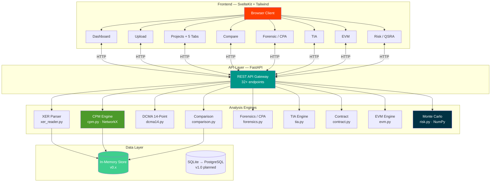
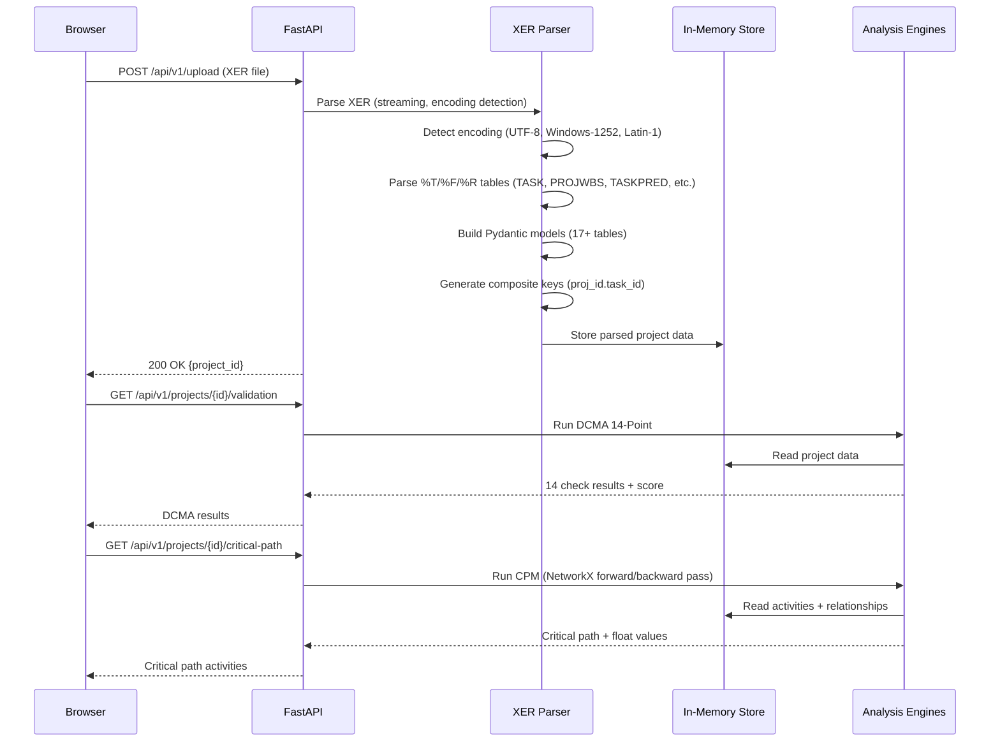
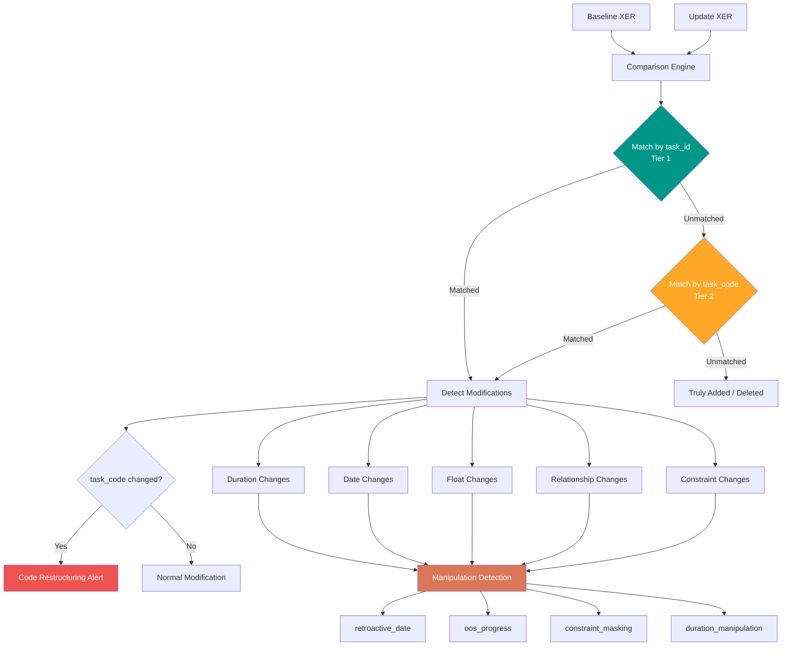
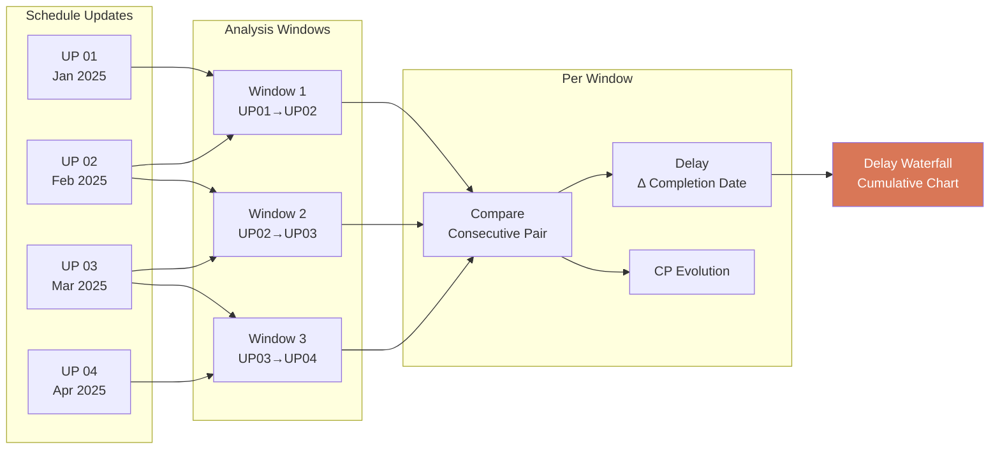
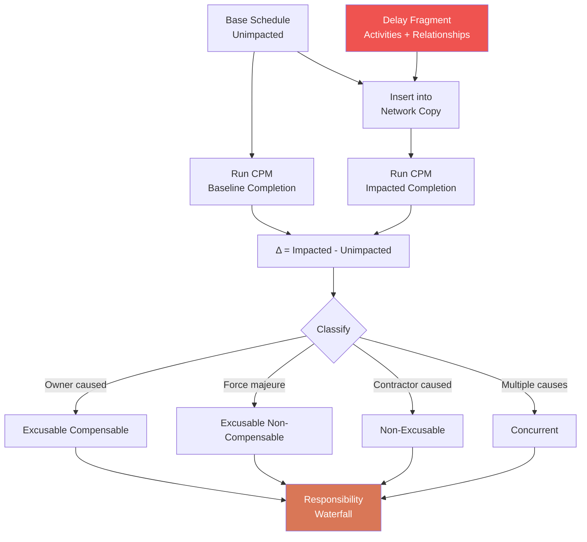
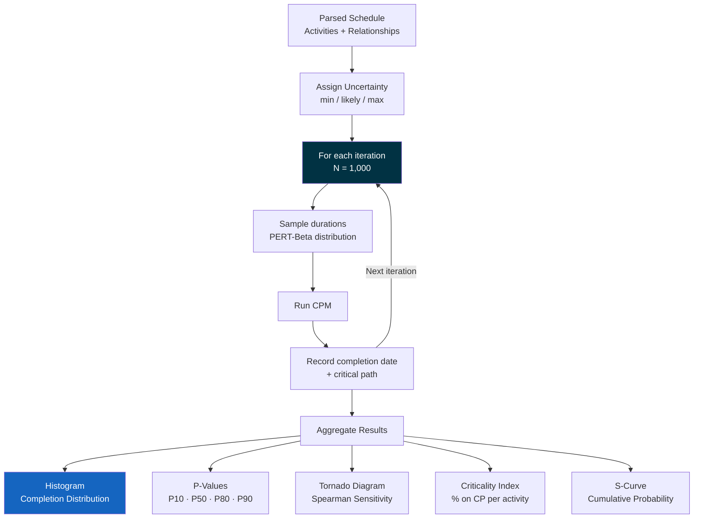
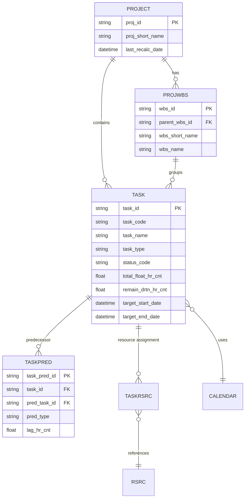

<!-- Last updated: 2026-03-26 -->
# MeridianIQ — System Architecture

## System Overview

MeridianIQ follows a **modular monolith** pattern: a single FastAPI application with clearly separated analysis engines, each implementing a specific published methodology. The frontend is a SvelteKit SPA communicating via REST API.



---

## Data Flow

### XER Upload → Analysis



### Schedule Comparison — Multi-Layer Matching



### Forensic CPA — Window Analysis



### TIA — Time Impact Analysis



### Monte Carlo QSRA



---

## Analysis Engines

| Engine | File | Lines | Standard | Key Dependencies |
|--------|------|-------|----------|-----------------|
| **XER Parser** | `src/parser/xer_reader.py` | 403 | — | Pydantic v2 |
| **CPM** | `src/analytics/cpm.py` | 405 | Kelly & Walker (1959) | NetworkX |
| **DCMA 14-Point** | `src/analytics/dcma14.py` | 651 | DCMA EVMS | — |
| **Comparison** | `src/analytics/comparison.py` | 916 | — | — |
| **Forensics (CPA)** | `src/analytics/forensics.py` | 435 | AACE RP 29R-03 | — |
| **TIA** | `src/analytics/tia.py` | 746 | AACE RP 52R-06 | NetworkX |
| **Contract** | `src/analytics/contract.py` | 671 | AIA A201, SCL Protocol | — |
| **EVM** | `src/analytics/evm.py` | 685 | ANSI/EIA-748 | — |
| **Monte Carlo** | `src/analytics/risk.py` | 723 | AACE RP 57R-09 | NumPy |

---

## API Endpoints

### Core (v0.1)
| Method | Endpoint | Description |
|--------|----------|-------------|
| POST | `/api/v1/upload` | Upload and parse XER file |
| GET | `/api/v1/projects` | List all parsed projects |
| GET | `/api/v1/projects/{id}` | Project detail with WBS stats |
| GET | `/api/v1/projects/{id}/validation` | DCMA 14-Point results |
| GET | `/api/v1/projects/{id}/critical-path` | Critical path activities |
| GET | `/api/v1/projects/{id}/float-distribution` | Float buckets |
| GET | `/api/v1/projects/{id}/milestones` | Milestone variance |
| POST | `/api/v1/compare` | Compare two schedules |

### Forensics (v0.2)
| Method | Endpoint | Description |
|--------|----------|-------------|
| POST | `/api/v1/forensic/create-timeline` | Create CPA timeline |
| GET | `/api/v1/forensic/timelines` | List timelines |
| GET | `/api/v1/forensic/timelines/{id}` | Timeline detail |
| GET | `/api/v1/forensic/timelines/{id}/delay-trend` | Delay waterfall data |

### Claims (v0.3)
| Method | Endpoint | Description |
|--------|----------|-------------|
| POST | `/api/v1/tia/analyze` | Run TIA with fragments |
| GET | `/api/v1/tia/analyses` | List TIA analyses |
| GET | `/api/v1/tia/analyses/{id}` | TIA detail |
| GET | `/api/v1/tia/analyses/{id}/summary` | Delay by responsibility |
| POST | `/api/v1/contract/check` | Run compliance checks |
| GET | `/api/v1/contract/provisions` | List provisions |

### Controls (v0.4)
| Method | Endpoint | Description |
|--------|----------|-------------|
| POST | `/api/v1/evm/analyze/{project_id}` | Run EVM analysis |
| GET | `/api/v1/evm/analyses` | List EVM analyses |
| GET | `/api/v1/evm/analyses/{id}` | EVM metrics detail |
| GET | `/api/v1/evm/analyses/{id}/s-curve` | S-curve data |
| GET | `/api/v1/evm/analyses/{id}/wbs-drill` | WBS cost breakdown |
| GET | `/api/v1/evm/analyses/{id}/forecast` | EAC scenarios |

### Risk (v0.5)
| Method | Endpoint | Description |
|--------|----------|-------------|
| POST | `/api/v1/risk/simulate/{project_id}` | Run Monte Carlo |
| GET | `/api/v1/risk/simulations` | List simulations |
| GET | `/api/v1/risk/simulations/{id}` | Simulation results |
| GET | `/api/v1/risk/simulations/{id}/histogram` | Completion histogram |
| GET | `/api/v1/risk/simulations/{id}/tornado` | Sensitivity data |
| GET | `/api/v1/risk/simulations/{id}/criticality` | Criticality index |
| GET | `/api/v1/risk/simulations/{id}/s-curve` | Cumulative probability |

---

## Data Model

### XER Tables Parsed



### In-Memory Store (v0.x)

All parsed data lives in Python dictionaries keyed by `project_id`. Each restart clears the store. Planned migration path:

```
v0.x: In-Memory (dict) → v1.0: SQLite → v1.x: PostgreSQL
```

---

## Frontend Pages

| Route | Description | API Dependency |
|-------|-------------|----------------|
| `/` | Dashboard — upload, project list | `GET /projects` |
| `/upload` | XER file upload | `POST /upload` |
| `/projects` | Project listing | `GET /projects` |
| `/projects/{id}` | 5-tab detail (Overview, DCMA, CP, Float, Milestones) | Multiple endpoints |
| `/compare` | Schedule comparison | `POST /compare` |
| `/forensic` | CPA timeline list + creation | Forensic endpoints |
| `/forensic/{id}` | Delay waterfall + window detail | Timeline endpoints |
| `/tia` | TIA analysis + fragment editor | TIA endpoints |
| `/tia/{id}` | TIA results + responsibility waterfall | TIA endpoints |
| `/evm` | EVM dashboard + S-curve | EVM endpoints |
| `/evm/{id}` | EVM detail + WBS drill-down | EVM endpoints |
| `/risk` | Monte Carlo setup + results | Risk endpoints |
| `/risk/{id}` | Histogram, tornado, criticality, S-curve | Risk endpoints |

---

## Design Principles

1. **Modular Engines** — Each analysis engine is a standalone Python module with no cross-dependencies. Engines communicate only through the data layer.
2. **Standards-First** — Every methodology traceable to a published standard. Code comments cite the relevant AACE RP, DCMA guideline, or academic reference.
3. **Progressive Complexity** — v0.x uses in-memory storage for rapid prototyping. Persistence (SQLite/PostgreSQL) planned for v1.0 without changing the API contract.
4. **Custom Parser** — MIT-licensed XER parser (cannot use GPL alternatives). Streaming, encoding-aware, handles real production files (8,000+ activities).
5. **Zero Cost** — No paid dependencies. All libraries are MIT/BSD compatible.

---

## Legacy v1 Architecture

The original v1 toolkit used Power Query (M Language) and DAX in Power BI for XER parsing and analysis. This approach is preserved in the `v1-reader/`, `v1-compare/`, and `v1-program-schedule/` directories.

For the legacy architecture documentation, see [`v1-architecture.md`](v1-architecture.md).

---

<div align="center">

**MeridianIQ** · MIT License · © 2025 Vitor Maia Rodovalho

</div>
