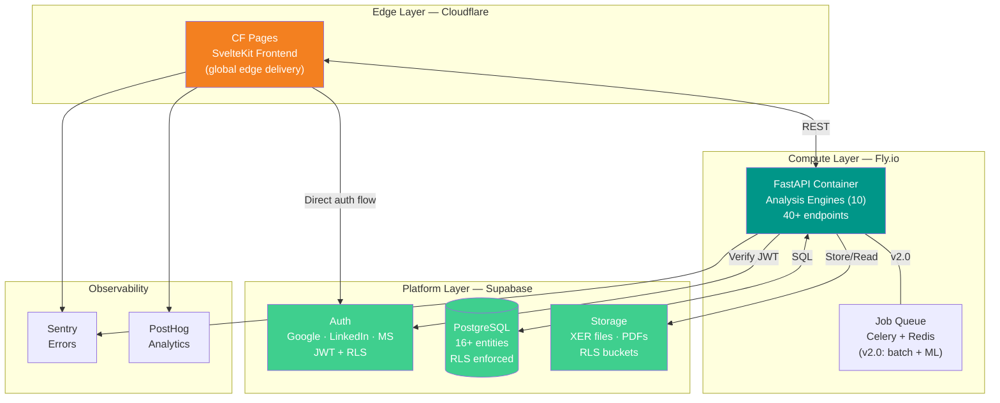
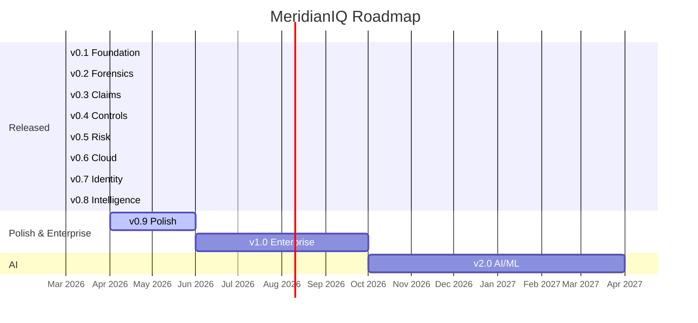

<!-- Last updated: 2026-03-28 -->
# MeridianIQ — Roadmap v0.6 → v2.0

**Document Type:** Planning Specification
**Status:** Approved
**Author:** Vitor Maia Rodovalho
**Date:** 2026-03-28

---

## Strategic Decisions

The following decisions were made during the v0.6 planning session, resolving all contradictions identified in the Discovery Review.

### Resolved Contradictions

| # | Contradiction | Resolution | Rationale |
|---|--------------|------------|-----------|
| 1 | Open-source vs open-core | **MIT pure** — entire platform free, zero paywall | Academic/portfolio project. MIT "AS IS" clause provides legal protection. Open-core remains possible in the future via separate enterprise module without changing core license. |
| 2 | SQLite vs PostgreSQL | **Supabase PostgreSQL directly** — skip SQLite | Author has production Supabase experience. RLS built-in, managed service, free tier covers v0.6→v1.0. |
| 3 | Epic count (10 vs 16) | **16 epics acknowledged** — 6 new from expert consultation integrated into roadmap | New epics (11-16) mapped to v0.8-v2.0 based on priority. |
| 4 | API paths | **`/api/v1/` prefix is canonical** — ARCHITECTURE_DRAFT.md paths are historical | Current implementation (40+ endpoints) is the authority. |
| 5 | Version labeling | **Git tags are canonical** — MVP_DEFINITION.md is historical | v0.1.0-v0.5.0, v0.7.0, v0.8.0 released and tagged. Roadmap continues from v0.9. |

### Architecture Decisions

| Decision | Choice | Alternatives Considered | Rationale |
|----------|--------|------------------------|-----------|
| **Licensing** | MIT pure | Open-core, AGPL | Zero commercial intent. MIT "AS IS" provides liability protection. Can add enterprise module later without changing core. |
| **Frontend hosting** | Cloudflare Pages | Vercel, Netlify | Free tier, global edge, SvelteKit adapter-cloudflare is first-class. |
| **API Gateway** | Cloudflare Workers | None, nginx | Edge CORS/routing/rate-limiting. Protects backend. Free 100K req/day. |
| **Backend compute** | Fly.io (Docker) | Railway, Cloud Run, Lambda | Python-native (NumPy/NetworkX/PyTorch), no time limits, GPU machines available for v2.0 ML. Docker = zero vendor lock-in. |
| **Database** | Supabase PostgreSQL | SQLite, self-hosted PG | Managed, RLS, free 500MB, author has production experience. |
| **Auth** | Supabase Auth | Auth0, Clerk, custom | Google+LinkedIn+Microsoft OAuth. JWT integrates with RLS. |
| **File storage** | Supabase Storage | S3, R2, local filesystem | RLS-protected buckets, CDN, free 1GB. XER files + generated PDFs. |
| **Monitoring** | Sentry + PostHog | Datadog, self-hosted | Free tiers. |

### Architecture Diagram

### Cost Projection

| Service | Free Tier | Sufficient Until | Paid Cost After |
|---------|-----------|-----------------|-----------------|
| Supabase | 500MB DB, 1GB storage, 50K auth users | v1.0+ | $25/mo (Pro) |
| Cloudflare Pages | Unlimited bandwidth, 500 builds/mo | v2.0 | Free forever |
| Cloudflare Workers | 100K requests/day | v2.0 | $5/mo |
| Fly.io | 3 shared VMs, 160GB outbound | ~v0.9 | $5-10/mo |
| Sentry | 5K errors/mo | v1.0 | Free forever (OSS plan) |
| PostHog | 1M events/mo | v1.0 | Free forever (OSS plan) |
| **Total** | **$0/mo** | **~v0.9** | **~$10-35/mo** |

---

## Version Roadmap

### v0.5.0 "Risk" — ✅ RELEASED

**What existed at v0.5.0:**
- 8 analysis engines (Parser, CPM, DCMA, Comparison, CPA, TIA, EVM, Monte Carlo)
- 222 tests passing
- ~9,150 lines Python, 32+ endpoints
- SvelteKit frontend with 13+ routes
- In-memory storage (no persistence)
- Runs on localhost only
- No authentication
- No database

---

### v0.6 "Cloud" — ✅ RELEASED

**Objective:** Any scheduler in the world visits the platform, uploads an XER, and sees analysis results.

**What was delivered:**
- Supabase PostgreSQL project, schema, and data layer abstraction
- In-memory → Supabase PostgreSQL migration for all schedule data
- Supabase Storage integration — XER files stored in RLS buckets
- Fly.io deployment — Dockerfile, fly.toml, auto-deploy from GitHub main
- Cloudflare Pages deployment — SvelteKit adapter-cloudflare, live at meridianiq.vitormr.dev
- Environment configuration — .env management for Supabase/Fly.io secrets
- Basic error handling — global exception handler, structured errors

**NOT delivered in v0.6:**
- CF Workers API proxy (direct CF Pages → Fly.io instead)
- Custom domain (meridianiq.app / .dev)
- Sentry integration

**Scope:**

| # | Item | Description | Effort | Priority | Status |
|---|------|-------------|--------|----------|--------|
| 1 | Supabase project setup | Create project, configure schema for 16+ entities | High | P0 | ✅ Done |
| 2 | Database migration | Replace in-memory dict store with Supabase PostgreSQL | High | P0 | ✅ Done |
| 3 | Parser versioning | Each parsed XER stored with parser_version | Medium | P1 | ❌ Deferred |
| 4 | Supabase Storage integration | XER file uploads persist in Supabase Storage bucket | Medium | P0 | ✅ Done |
| 5 | Fly.io deployment | Dockerfile + fly.toml. Auto-deploy from GitHub main branch | Medium | P0 | ✅ Done |
| 6 | Cloudflare Pages deployment | SvelteKit adapter-cloudflare. Build from web/ directory | Medium | P0 | ✅ Done |
| 7 | CF Workers API proxy | Route /api/* requests to Fly.io backend | Medium | P1 | ❌ Not implemented |
| 8 | Domain setup | meridianiq.app or meridianiq.dev — CF DNS + SSL | Low | P1 | ❌ Not done |
| 9 | PDF export | Generate PDF reports for DCMA, comparison, forensic results | Medium | P2 | ↗ Deferred to v0.8 |
| 10 | Environment configuration | .env management for Supabase URL/keys, Fly.io secrets | Low | P0 | ✅ Done |
| 11 | Basic error handling | Global exception handler, structured errors, Sentry integration | Low | P1 | ✅ Partial (no Sentry) |

---

### v0.7 "Identity" — ✅ RELEASED

**Objective:** Users create accounts. Uploads belong to their profile. Data is private by default.

**What was delivered:**
- Google + Microsoft + LinkedIn OAuth via Supabase Auth
- ES256 JWT with JWKS endpoint for backend verification
- Row Level Security (RLS) policies — users only see own data
- API authentication — Bearer token on all protected endpoints
- Frontend auth flow — login page, OAuth redirect, session management, logout
- User ownership on all ScheduleUpload records

**NOT delivered in v0.7:**
- Anonymous/demo mode (unauthenticated access to sample data)
- Account settings page (view profile, usage stats)

**Scope:**

| # | Item | Description | Effort | Priority | Status |
|---|------|-------------|--------|----------|--------|
| 1 | Supabase Auth integration | Google + LinkedIn + Microsoft OAuth. JWT tokens | Medium | P0 | ✅ Done |
| 2 | User profiles table | id, name, email, company, role, created_at | Low | P0 | ✅ Done |
| 3 | Project ownership | Every ScheduleUpload has user_id FK | Medium | P0 | ✅ Done |
| 4 | Row Level Security | PostgreSQL RLS policies: user only sees own data | Medium | P0 | ✅ Done |
| 5 | API authentication | Bearer token on all /api/v1/* endpoints | Medium | P0 | ✅ Done |
| 6 | Frontend auth flow | Login page, OAuth redirect, session management, logout | Medium | P0 | ✅ Done |
| 7 | Anonymous/demo mode | Unauthenticated access to sample data | Low | P2 | ❌ Deferred |
| 8 | Account settings page | View profile, change display name, usage stats | Low | P2 | ❌ Deferred |

**Does NOT include:** Teams, organizations, sharing, admin panel.

---

### v0.8 "Intelligence" — ✅ RELEASED

**Objective:** Features that no open-source competitor offers. Proactive schedule monitoring.

**What was delivered:**
- Float trend tracking — track float distribution across sequential uploads
- Early Warning System — 12 configurable alert rules (float velocity, CP changes, DCMA threshold breaches, etc.)
- Schedule Health Score — composite metric combining DCMA score, float health, critical path stability, and early warning signals
- PDF Reports — 5 report types via WeasyPrint (DCMA, comparison, forensic, EVM, health summary)
- Auto-pipeline — upload → parse → validate → compute trends → check alerts → update health score
- Enhanced dashboard — KPIs, project alerts panel, health score widget

**NOT delivered in v0.8:**
- Enhanced manipulation scoring (Normal / Suspicious / Red Flag classification)
- Monthly review template (standardized workflow, exportable PDF)
- Novel metrics (float entropy, constraint accumulation rate)

**Scope:**

| # | Item | Description | Effort | Priority | Status |
|---|------|-------------|--------|----------|--------|
| 1 | Float trend tracking | Track float distribution across sequential uploads | High | P0 | ✅ Done |
| 2 | Early Warning System | Alert thresholds for float velocity, CP changes | High | P0 | ✅ Done (12 rules) |
| 3 | Schedule Review Pipeline | Automated upload → validate → report → notify | High | P0 | ✅ Done |
| 4 | Enhanced manipulation scoring | Normal / Suspicious / Red Flag classification | Medium | P1 | ❌ Deferred |
| 5 | Schedule Health Score | Composite metric combining all indicators | Medium | P1 | ✅ Done |
| 6 | Monthly review template | Standardized workflow, exportable PDF | Medium | P2 | ❌ Deferred |
| 7 | Novel metrics | Float velocity, float entropy, constraint accumulation rate | Low | P2 | ❌ Deferred (float velocity done; entropy/CAR not) |

**Does NOT include:** ML-based prediction, NLP, federated learning.

---

### "What exists today" — v0.8.1 State

- **10 analysis engines:** Parser, CPM, DCMA, Comparison, CPA, TIA, EVM, Monte Carlo, Float Trends + Early Warning, Health Score
- **332 tests passing** (6 skipped)
- **~12,000+ lines Python**, 40+ endpoints
- **SvelteKit frontend** — 16+ pages
- **Supabase PostgreSQL** — persistent data, RLS enforced
- **Supabase Storage** — XER files and generated PDFs
- **Supabase Auth** — Google + Microsoft + LinkedIn OAuth, ES256 JWT
- **Fly.io** — containerised backend, auto-deploy from main
- **Cloudflare Pages** — live at [meridianiq.vitormr.dev](https://meridianiq.vitormr.dev)
- **Supabase migrations** — 4 migration files (001–004)
- **Known issue:** Fly.io cold start ~10s causes 502 + CORS on first request

---

### v0.9 "Polish" — 🚧 Next

**Objective:** Transform from developer prototype to professional tool.

**Scope:**

| # | Item | Description | Effort | Priority |
|---|------|-------------|--------|----------|
| 1 | Frontend redesign | Design system, responsive layout, dark mode, WCAG 2.1 AA | High | P0 |
| 2 | Performance optimization | Monte Carlo <5s for 10K activities, pagination, indexed queries | High | P0 |
| 3 | CI/CD pipeline | GitHub Actions: test, lint, build, deploy on merge to main | Medium | P0 |
| 4 | E2E tests | Playwright for critical flows | Medium | P1 |
| 5 | Sentry integration | Error tracking with source maps and tracebacks | Low | P1 |
| 6 | PostHog integration | Feature usage analytics, funnel analysis | Low | P2 |
| 7 | Documentation site | User guides, API reference, video walkthroughs | Medium | P2 |
| 8 | Onboarding flow | Guided first-time user experience | Low | P2 |
| 9 | Internationalization | i18n infrastructure. EN default, PT-BR and ES ready | Medium | P2 |
| 10 | Fix cold start | Resolve Fly.io ~10s cold start causing 502+CORS on first request | Medium | P0 |
| 11 | Anonymous/demo mode | Unauthenticated access to sample data (deferred from v0.7) | Low | P2 |
| 12 | Account settings page | View profile, change display name, usage stats (deferred from v0.7) | Low | P2 |

**Does NOT include:** New analysis features. Quality, not features.

**Exit criteria:** A scheduler who has never seen the platform can upload an XER and understand the results without documentation.

---

### v1.0 "Enterprise" — Organizations, not just individuals

**Objective:** Construction firms and CM consultancies use MeridianIQ as a team tool.

**Scope:**

| # | Item | Description | Effort | Priority |
|---|------|-------------|--------|----------|
| 1 | Teams/Organizations | Create org, invite members, manage roles | High | P0 |
| 2 | Project sharing | Share projects with team members, granular permissions | High | P0 |
| 3 | IPS Reconciliation | Link master schedule ↔ sub-schedules, verify consistency. Per AACE RP 71R-12 | High | P0 |
| 4 | Audit trail | Log all actions. Immutable audit log. Essential for litigation | Medium | P0 |
| 5 | API documentation | OpenAPI spec, interactive docs, API keys | Medium | P1 |
| 6 | Multi-format support | Microsoft Project XML via MPXJ bridge or native parser | High | P1 |
| 7 | Benchmark database | Anonymized aggregated data for cross-project comparison | High | P2 |
| 8 | Recovery schedule validation | Per AACE RP 29R-03 Section 4 | Medium | P2 |
| 9 | Secure Forensic Workspace | Access-controlled environment for litigation-sensitive analysis | Medium | P2 |
| 10 | Value Milestones | Business metadata on milestones: commercial value, payment triggers | Low | P2 |

**Exit criteria:** A CM firm creates an organization, invites 5 team members, uploads a program schedule with 3 sub-schedules, runs IPS reconciliation, and generates an audit-trailed report.

---

### v2.0 "AI" — Machine Learning and NLP

**Objective:** The platform learns from historical schedules and provides predictive insights.

**Scope:**

| # | Item | Description |
|---|------|-------------|
| 1 | Delay prediction | ML model trained on historical schedule updates |
| 2 | NLP queries | Natural language interface for schedule data |
| 3 | Anomaly detection | Unsupervised ML for unusual schedule patterns |
| 4 | Benchmark intelligence | Automatic comparison against anonymized dataset |
| 5 | Root cause analysis | Trace backwards through the network to identify originating delay event |
| 6 | GPU compute | Fly.io GPU machines for model training and inference |
| 7 | Federated learning | Cross-organization model training without centralizing data |
| 8 | MCP server | Model Context Protocol integration for AI assistant queries |

**Exit criteria:** Platform predicts completion date probability based on historical patterns, not just current-state Monte Carlo.

---

## Roadmap Summary

| Version | Codename | Focus | Key Deliverable |
|---------|----------|-------|-----------------|
| ~~v0.1~~ | ~~Foundation~~ | ~~Parse · Validate · Compare~~ | ✅ Released |
| ~~v0.2~~ | ~~Forensics~~ | ~~CPA / Window Analysis~~ | ✅ Released |
| ~~v0.3~~ | ~~Claims~~ | ~~TIA + Contract Compliance~~ | ✅ Released |
| ~~v0.4~~ | ~~Controls~~ | ~~EVM + Rebrand~~ | ✅ Released |
| ~~v0.5~~ | ~~Risk~~ | ~~Monte Carlo / QSRA~~ | ✅ Released |
| ~~v0.6~~ | ~~Cloud~~ | ~~Supabase + Fly.io + CF Pages~~ | ✅ Released |
| ~~v0.7~~ | ~~Identity~~ | ~~Auth + RLS + Ownership~~ | ✅ Released |
| ~~v0.8~~ | ~~Intelligence~~ | ~~Float Trends + Early Warning + Health Score~~ | ✅ Released |
| **v0.9** | **Polish** | **UX + Performance + CI/CD** | Production quality |
| **v1.0** | **Enterprise** | **Teams + IPS + Audit** | Multi-org, litigation-ready |
| **v2.0** | **AI** | **ML + NLP + Prediction** | Predictive intelligence |

---

## Applicable Standards

| Standard | Applied In |
|----------|-----------|
| AACE RP 29R-03 | Forensic Schedule Analysis (v0.2), Recovery Schedule Validation (v1.0) |
| AACE RP 49R-06 | Documenting the Schedule Basis — Float Trend Tracking (v0.8) |
| AACE RP 52R-06 | Time Impact Analysis (v0.3) |
| AACE RP 57R-09 | Monte Carlo QSRA (v0.5) |
| AACE RP 10S-90 | EVM Terminology (v0.4) |
| AACE RP 71R-12 | IPS Reconciliation (v1.0) |
| ANSI/EIA-748 | Earned Value Management (v0.4) |
| DCMA EVMS | 14-Point Assessment (v0.1), Early Warning thresholds (v0.8) |
| GAO Schedule Guide | Schedule Assessment Methodology (v0.1) |
| SCL Protocol | Delay and Disruption Protocol (v0.3) |
| AIA A201 | Contract Compliance (v0.3) |

---

## Open Research Questions (for v2.0 Academic Track)

1. Are DCMA 5% thresholds statistically justified across project types?
2. Can float velocity predict schedule failure before it's visible to humans?
3. Is federated learning viable for cross-org model training without data sharing?
4. What is the optimal WBS decomposition depth by project type and size?
5. Can ML detect schedule manipulation more reliably than rule-based checks?

These questions form the basis for potential PhD research outputs.

---

**MeridianIQ** · MIT License · © 2025 Vitor Maia Rodovalho

*Every methodology traceable to published standards. Every decision documented.*

